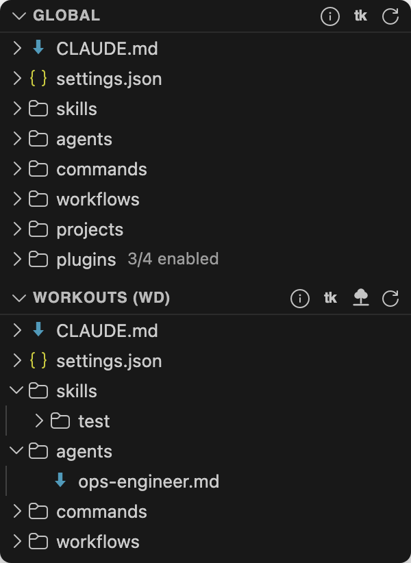
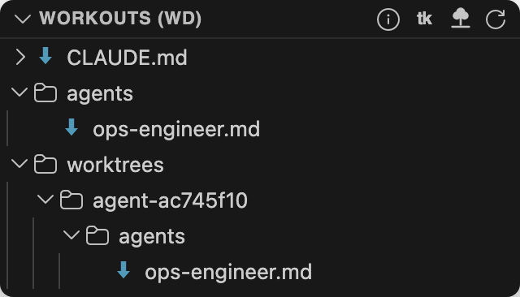
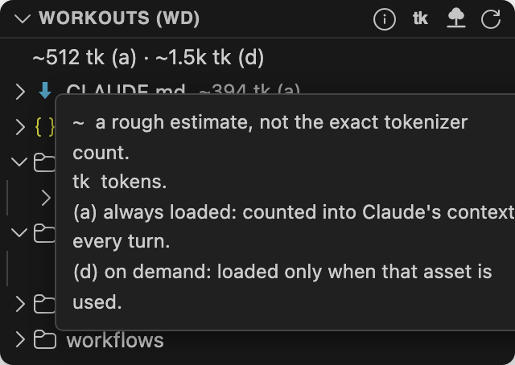

# Claude Asset Manager

A VSCode extension that puts every Claude Code asset on your machine in one sidebar: skills,
subagents, slash commands, memory and CLAUDE.md files, `.claude` config, and installed plugins.
It scans your global `~/.claude` directory, your installed plugins, and your projects, then
groups everything so you can find, open, and manage any asset in a few clicks.

## What it shows

Open the **Claude Asset Manager** icon in the Activity Bar to reveal two sections.

### Working Directory

This is the section that answers "what is Claude actually looking at here?" It is titled after
the folder you have open (for example `Projects (WD)`) and shows every Claude Code asset that
applies to your current workspace:

- The open folder's own `.claude` assets (CLAUDE.md, config, skills, subagents, commands) listed
  at the top.
- One folder per sub-project, each with its own CLAUDE.md, config, and asset groups.
- Git worktrees, hidden by default and grouped under a **Worktrees** folder when shown, so they do
  not clutter or double-count the project's assets. Toggle them with the tree icon in the section
  title bar.

In other words, the whole set of skills, agents, commands, workflows, memory, and config Claude can pull
into a session for the directory you are working in, laid out in one place.

### Global

Your machine-wide `~/.claude` assets:

- CLAUDE.md and config files first, then **Skills**, **Subagents**, **Commands**, and **Workflows**.
- A **Projects** folder holding per-project memory.
- A **Plugins** folder listing every installed plugin, nested under its source marketplace with
  its version, and an `N Updates available` indicator when a newer version exists in your local
  catalog (no network calls are made).

### Details that keep the tree clean

- **Full file trees for skills and agents** mirror their real directories, so every file and
  subdirectory is shown, not just the entry file.
- **Scoped discovery** recognizes config only inside a `.claude/` directory, picks up CLAUDE.md
  only at sensible locations (global, a project or worktree root, or inside `.claude/`), follows
  symlinks, and skips noise like `node_modules`, `.git`, `bin`, and `obj`.

## Token estimates

See roughly how much of Claude's context each asset costs. Turn it on per section with the **tk**
icon in the title bar (off by default), and every row, group folder, and a summary row at the top
of the section gains an estimate split two ways:

- **(a) always loaded**: counted into Claude's context every turn (CLAUDE.md, a skill's name and
  description).
- **(d) on demand**: loaded only when that asset is actually used (a skill's body, a command, a
  workflow).

Counts are local heuristics shown with a `~` (about four characters per token), not the exact
tokenizer, and worktree copies are excluded so duplicates do not inflate the totals. The **info**
icon in the title bar spells out every abbreviation, and hovering the summary row shows the same
legend.

## Using it

### Opening assets

- **Click** any file to open it (markdown opens in the rendered preview; config opens in the editor).
- **Right-click** a file for **Open File**, **Open Preview**, **Reveal in File Manager**, and **Delete**.
- **Right-click** a folder for **Reveal in File Manager** and **Delete**, including the per-project
  folders under **Projects**. Plugin folders are managed by Claude and cannot be deleted here.
- **Delete** moves the item to the system trash and asks for confirmation first.

### Managing plugins

Plugin actions shell out to the Claude Code CLI and require `claude` on your `PATH`. After any
change, restart your Claude Code session to apply it.

- **Manage Plugins**: click the gear icon on the **Plugins** folder, or right-click the **Plugins**
  folder or a marketplace, to open a graphical panel. It searches a marketplace's catalog and
  installs, uninstalls, enables, or disables plugins (paged 50 at a time), and can add or remove a
  marketplace. Right-clicking a marketplace opens the panel scoped to it.
- **Enable Plugin** / **Disable Plugin**: right-click a plugin to toggle it.
- **Update Plugin**: right-click an out-of-date plugin.
- **Update Plugins**: right-click a marketplace folder to update every out-of-date plugin from it.
- **Update All Plugins**: right-click the **Plugins** folder.
- **Uninstall Plugin**: right-click a plugin.
- **Add Marketplace** / **Remove Marketplace** / **Refresh Source**: right-click the **Plugins**
  folder or a marketplace.

Each action confirms before running where it is destructive and shows the exact command it will
execute. Files inside a plugin cannot be deleted individually; uninstall the plugin instead.

### Refresh

**Refresh** in the section title bar rescans everything.

## Settings

- `claudeAssets.directories`: additional directories to scan recursively for projects.
- `claudeAssets.followSymlinks`: follow symbolic links while scanning (default `true`).
- `claudeAssets.excludeDirs`: directory names to skip during recursive scans.
- `claudeAssets.showTokenUsageGlobal` / `claudeAssets.showTokenUsageWorkingDirectory`: show token
  estimates in each section (default `false`; also toggled from the **tk** title-bar icon).
- `claudeAssets.showWorktrees`: show git worktrees in the Working Directory section (default
  `false`; also toggled from the tree title-bar icon).

## Requirements

- VSCode 1.90 or newer.
- For plugin update and uninstall actions, the [Claude Code](https://claude.com/claude-code) CLI
  (`claude`) must be on your `PATH`. On macOS, launch VSCode from a terminal so the extension host
  inherits your shell `PATH`; otherwise the CLI commands may not find `claude`.

## Issues and support

Open an issue at
[github.com/BradenTerry/ClaudeAssetManager/issues](https://github.com/BradenTerry/ClaudeAssetManager/issues).

## License

[MIT](LICENSE)
